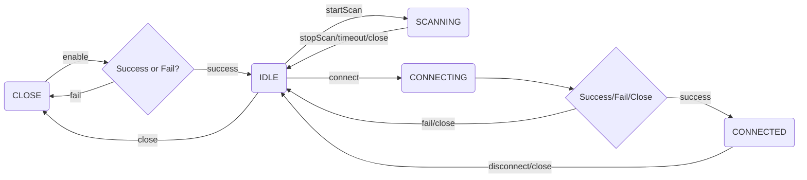

# Bluetooth

```mermaid
graph LR
start(CLOSE) --enable--> enable_res{Success or Fail?}
enable_res --success--> idle(IDLE) 
enable_res --fail--> start
idle --startScan--> scan(SCANNING)
scan --stopScan/timeout/close--> idle
idle --connect--> connecting(CONNECTING)-->connect_res{Success/Fail/Close}
connect_res --success--> connected(CONNECTED)
connect_res --fail/close--> idle
connected --disconnect/close--> idle
idle --close--> start
```